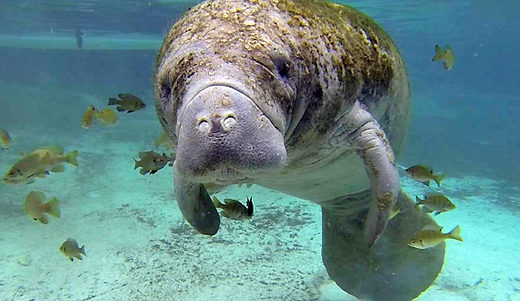

## About me: Kaitlyn Steck


## Provide basic biographical information: birthday, where you grew up

My birthday is July, 24, 2001.

I am a second year doctoral student in the Psychology: Neuroscience and Behavior program! I am originally from Grand Rapids, Michigan and I attended Western Michigan University for undergrad and my master's.

## My favorite animal



## My favorite plot

```{r}
x<- seq(from = -3, to = 3, length.out=100)
y <- dnorm(x, mean = 0, sd = 1)

norm_approx<- data.frame(x,y)

library(ggplot2)

scatterplot <- ggplot(data= norm_approx, aes(x=x, y=y)) +
  geom_point() +
  xlab("x") + ylab ("y") 

scatterplot
```

Beautiful normal distribution!

## Provide a link to your CV, which you will generate in the next part.

<https://github.com/stat850-unl/professional-communication-and-debugging-kaitlynsteck/blob/0b60118daea054f7ece27294f8f0dc8a233d2aab/KaitlynCV/KaitlynCV.qmd>
